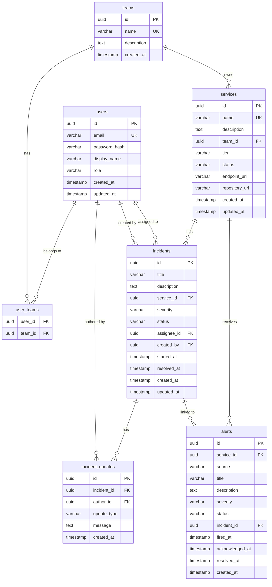

# ER 図

## エンティティ関連図（Mermaid）



---

## テーブル定義

### users

ユーザーアカウント情報とロールを管理します。

| カラム名 | 型 | 制約 | 説明 |
|----------|----|------|------|
| `id` | UUID | PK, DEFAULT gen_random_uuid() | ユーザー ID |
| `email` | VARCHAR(255) | NOT NULL, UNIQUE | メールアドレス（ログイン ID） |
| `password_hash` | VARCHAR(255) | NOT NULL | BCrypt ハッシュ化パスワード |
| `display_name` | VARCHAR(100) | NOT NULL | 表示名 |
| `role` | VARCHAR(20) | NOT NULL | `ADMIN` / `OPERATOR` / `VIEWER` |
| `created_at` | TIMESTAMP WITH TIME ZONE | NOT NULL, DEFAULT NOW() | |
| `updated_at` | TIMESTAMP WITH TIME ZONE | NOT NULL, DEFAULT NOW() | |

---

### teams

組織内のチーム（サービスオーナー単位）を管理します。

| カラム名 | 型 | 制約 | 説明 |
|----------|----|------|------|
| `id` | UUID | PK, DEFAULT gen_random_uuid() | チーム ID |
| `name` | VARCHAR(100) | NOT NULL, UNIQUE | チーム名 |
| `description` | TEXT | | チーム説明 |
| `created_at` | TIMESTAMP WITH TIME ZONE | NOT NULL, DEFAULT NOW() | |

---

### user_teams

ユーザーとチームの多対多関係を管理します。

| カラム名 | 型 | 制約 | 説明 |
|----------|----|------|------|
| `user_id` | UUID | FK → users.id | |
| `team_id` | UUID | FK → teams.id | |
| PK | (user_id, team_id) | | |

---

### services（サービス台帳）

管理対象サービスのカタログです。

| カラム名 | 型 | 制約 | 説明 |
|----------|----|------|------|
| `id` | UUID | PK, DEFAULT gen_random_uuid() | サービス ID |
| `name` | VARCHAR(100) | NOT NULL, UNIQUE | サービス名 |
| `description` | TEXT | | サービス説明 |
| `team_id` | UUID | FK → teams.id | オーナーチーム |
| `tier` | VARCHAR(10) | NOT NULL | `TIER1` / `TIER2` / `TIER3` |
| `status` | VARCHAR(20) | NOT NULL, DEFAULT 'OPERATIONAL' | `OPERATIONAL` / `DEGRADED` / `DOWN` / `MAINTENANCE` |
| `endpoint_url` | VARCHAR(500) | | サービスエンドポイント URL |
| `repository_url` | VARCHAR(500) | | リポジトリ URL |
| `created_at` | TIMESTAMP WITH TIME ZONE | NOT NULL, DEFAULT NOW() | |
| `updated_at` | TIMESTAMP WITH TIME ZONE | NOT NULL, DEFAULT NOW() | |

---

### incidents

インシデントのライフサイクルを管理します。

| カラム名 | 型 | 制約 | 説明 |
|----------|----|------|------|
| `id` | UUID | PK, DEFAULT gen_random_uuid() | インシデント ID |
| `title` | VARCHAR(255) | NOT NULL | インシデントタイトル |
| `description` | TEXT | | 詳細説明 |
| `service_id` | UUID | FK → services.id | 影響サービス |
| `severity` | VARCHAR(5) | NOT NULL | `P1` / `P2` / `P3` / `P4` |
| `status` | VARCHAR(20) | NOT NULL, DEFAULT 'OPEN' | `OPEN` / `INVESTIGATING` / `MITIGATED` / `RESOLVED` / `CLOSED` |
| `assignee_id` | UUID | FK → users.id, NULLABLE | 担当者 |
| `created_by` | UUID | FK → users.id, NOT NULL | 起票者 |
| `started_at` | TIMESTAMP WITH TIME ZONE | NOT NULL | 障害発生日時 |
| `resolved_at` | TIMESTAMP WITH TIME ZONE | NULLABLE | 解決日時（MTTR 計算に使用） |
| `created_at` | TIMESTAMP WITH TIME ZONE | NOT NULL, DEFAULT NOW() | |
| `updated_at` | TIMESTAMP WITH TIME ZONE | NOT NULL, DEFAULT NOW() | |

---

### incident_updates（対応履歴）

インシデントに対する操作・コメントのタイムラインです。

| カラム名 | 型 | 制約 | 説明 |
|----------|----|------|------|
| `id` | UUID | PK, DEFAULT gen_random_uuid() | |
| `incident_id` | UUID | FK → incidents.id, NOT NULL | |
| `author_id` | UUID | FK → users.id, NOT NULL | 投稿者 |
| `update_type` | VARCHAR(20) | NOT NULL | `COMMENT` / `STATUS_CHANGE` / `ASSIGNEE_CHANGE` |
| `message` | TEXT | NOT NULL | 本文・変更内容 |
| `created_at` | TIMESTAMP WITH TIME ZONE | NOT NULL, DEFAULT NOW() | |

---

### alerts

外部監視ツールから受信したアラートを管理します。

| カラム名 | 型 | 制約 | 説明 |
|----------|----|------|------|
| `id` | UUID | PK, DEFAULT gen_random_uuid() | |
| `service_id` | UUID | FK → services.id, NULLABLE | 影響サービス |
| `source` | VARCHAR(50) | NOT NULL | `prometheus` / `cloudwatch` / `manual` |
| `title` | VARCHAR(255) | NOT NULL | アラート名 |
| `description` | TEXT | | 詳細 |
| `severity` | VARCHAR(20) | NOT NULL | `CRITICAL` / `WARNING` / `INFO` |
| `status` | VARCHAR(20) | NOT NULL, DEFAULT 'FIRING' | `FIRING` / `ACKNOWLEDGED` / `RESOLVED` |
| `incident_id` | UUID | FK → incidents.id, NULLABLE | 紐づくインシデント |
| `fired_at` | TIMESTAMP WITH TIME ZONE | NOT NULL | アラート発火日時 |
| `acknowledged_at` | TIMESTAMP WITH TIME ZONE | NULLABLE | |
| `resolved_at` | TIMESTAMP WITH TIME ZONE | NULLABLE | |
| `created_at` | TIMESTAMP WITH TIME ZONE | NOT NULL, DEFAULT NOW() | |

---

## インデックス設計

```sql
-- 頻繁なフィルタリングに対応
CREATE INDEX idx_incidents_status ON incidents(status);
CREATE INDEX idx_incidents_severity ON incidents(severity);
CREATE INDEX idx_incidents_service_id ON incidents(service_id);
CREATE INDEX idx_incidents_assignee_id ON incidents(assignee_id);
CREATE INDEX idx_incidents_started_at ON incidents(started_at DESC);

CREATE INDEX idx_alerts_status ON alerts(status);
CREATE INDEX idx_alerts_severity ON alerts(severity);
CREATE INDEX idx_alerts_service_id ON alerts(service_id);
CREATE INDEX idx_alerts_fired_at ON alerts(fired_at DESC);

CREATE INDEX idx_incident_updates_incident_id ON incident_updates(incident_id);
CREATE INDEX idx_services_status ON services(status);
```

---

## Enum 定義

```sql
-- ロール
CREATE TYPE user_role AS ENUM ('ADMIN', 'OPERATOR', 'VIEWER');

-- サービス ステータス
CREATE TYPE service_status AS ENUM ('OPERATIONAL', 'DEGRADED', 'DOWN', 'MAINTENANCE');

-- サービス ティア
CREATE TYPE service_tier AS ENUM ('TIER1', 'TIER2', 'TIER3');

-- インシデント 重大度
CREATE TYPE incident_severity AS ENUM ('P1', 'P2', 'P3', 'P4');

-- インシデント ステータス
CREATE TYPE incident_status AS ENUM ('OPEN', 'INVESTIGATING', 'MITIGATED', 'RESOLVED', 'CLOSED');

-- 対応履歴 種別
CREATE TYPE update_type AS ENUM ('COMMENT', 'STATUS_CHANGE', 'ASSIGNEE_CHANGE');

-- アラート 重大度
CREATE TYPE alert_severity AS ENUM ('CRITICAL', 'WARNING', 'INFO');

-- アラート ステータス
CREATE TYPE alert_status AS ENUM ('FIRING', 'ACKNOWLEDGED', 'RESOLVED');
```
